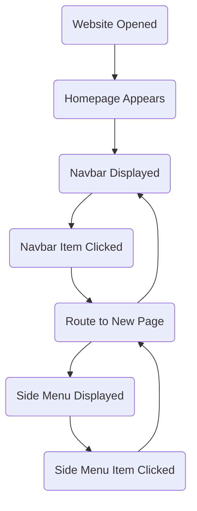
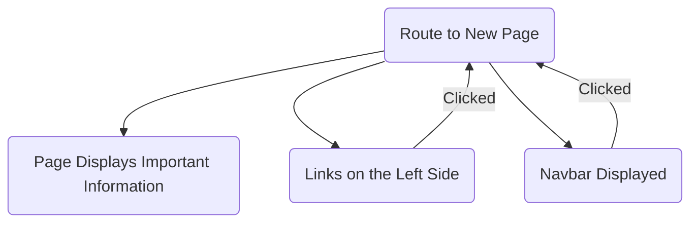
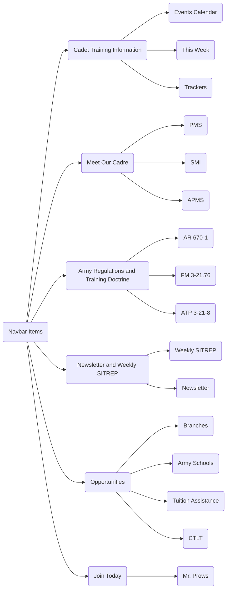

# Army ROTC Website Design Diagram
The goal for my project is to improve the UC Army ROTC website in order to improve communication within the Battalion and increase recruitment and retention within the program.

```
Text boxes represent actions items that appear or actions that could occur.
Lines between text boxes represent something that follows a previos action or an action that will occur.
```

### Design D0



### Design D1


### Design D2

