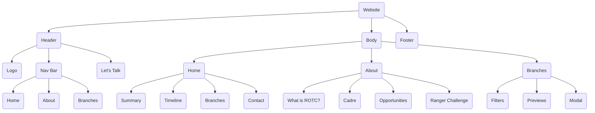

### System Overview

```mermaid
flowchart TD;

  A(Website) --> B(Header)
  A --> C(Body)
  A --> D(Footer)

  B --> B1(Logo)
  B --> B2(Nav Bar)
  B --> B3(Let's Talk)

  B2 --> B2a(Home)
  B2 --> B2b(About)
  B2 --> B2c(Branches)

  C --> C1(Home)
  C --> C2(About)
  C --> C3(Branches)

  C1 --> C1a(Summary)
  C1 --> C1b(Timeline)
  C1 --> C1c(Branches)
  C1 --> C1d(Contact)

  C2 --> C2a(What is ROTC?)
  C2 --> C2b(Cadre)
  C2 --> C2c(Opportunities)
  C2 --> C2d(Ranger Challenge)

  C3 --> C3a(Filters)
  C3 --> C3b(Previews)
  C3 --> C3c(Modal)
```
